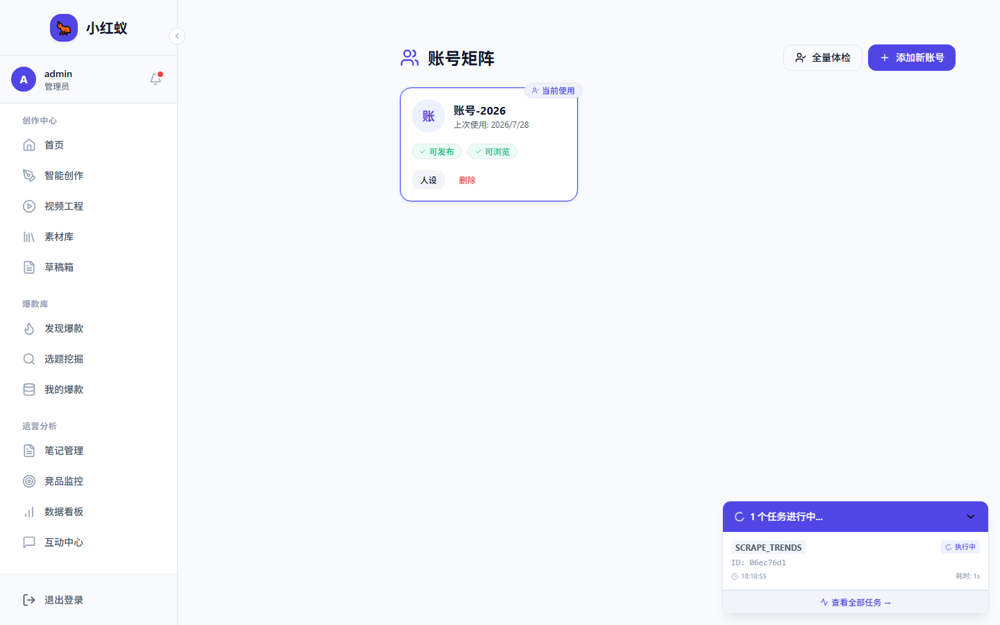

# 绑定小红书账号（浏览权限）

浏览权限是小红蚁抓取账号数据、监控对标竞品的基础。绑定成功后，系统会自动使用你的登录态访问小红书主页，获取笔记、粉丝等数据。

!!! warning "重要提醒"
    - 绑定浏览权限**必须**扫码登录，不能匿名访问。
    - 扫码时请在手机上**点击确认授权**，否则系统无法获取有效 Cookie。
    - 一个账号同时只能在一台设备上保持活跃扫码状态。

---

## 操作步骤

### 步骤 1：进入账号矩阵

在左侧导航栏点击 **账号矩阵**，进入账号管理页面。

### 步骤 2：添加或选择账号

- 如果是**首次使用**，点击 **添加账号** 按钮。
- 如果是**已有账号**，找到目标账号，点击 **绑定浏览** 按钮。

### 步骤 3：等待二维码生成

系统会自动打开一个浏览器窗口，加载小红书登录页并截取二维码。

!!! tip "二维码生成时间"
    通常 3~5 秒内即可看到二维码。如果超过 10 秒仍无二维码，请查看 [扫码失败排查](troubleshoot-login.md)。

> 二维码窗口为系统弹出的独立浏览器窗口，截图来自实际浏览器绑定流程。

### 步骤 4：使用手机小红书扫码

1. 打开手机上的**小红书 App**。
2. 点击底部 **我** → 右上角 **扫码** 图标。
3. 对准电脑屏幕上的二维码进行扫描。

### 步骤 5：在手机上确认授权

扫码后，手机上会弹出**确认授权**页面，请点击 **确认登录**。

!!! danger "关键步骤"
    **必须点击确认登录**，否则系统只会显示“已扫码，等待确认”，最终超时失败。

> 手机确认授权步骤需在小红书 App 内完成，请留意 App 弹窗。

### 步骤 6：等待系统验证

电脑端二维码窗口会自动关闭，账号矩阵中该账号的状态变为 **可预览**。

---

## 状态说明

| 状态 | 含义 | 操作建议 |
|---|---|---|
| 未授权 | 账号尚未绑定任何权限 | 点击 **绑定浏览** 扫码 |
| 可预览 | 已获取浏览权限，可抓取数据 | 正常使用 |
| 可发布 | 同时具备浏览和发布权限 | 正常使用 |
| 已过期 | Cookie 失效，需要重新扫码 | 点击 **重新绑定** |

---

## 常见问题速查

**Q：二维码窗口一闪就关了，怎么办？**

A：这通常是因为系统误判了登录状态。请查看 [扫码失败排查](troubleshoot-login.md) 中的“窗口一闪而过”章节。

**Q：我已经扫码了，但状态还是“未授权”？**

A：检查手机上是否点击了 **确认登录**。只扫码不确认，系统拿不到有效 Cookie。

**Q：绑定成功后多久需要重新扫码？**

A：小红书 Cookie 有效期通常为 7~30 天，具体取决于账号安全策略。系统会在 Cookie 即将过期前提醒。
