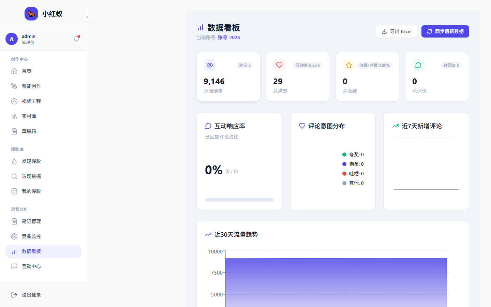

# 数据看板

数据看板汇总了小红蚁的核心运营指标，帮助你快速掌握账号表现和内容效果。

## 入口

点击左侧导航 **数据看板** 即可进入。

## 主要指标

- **账号总览**：粉丝数、获赞数、笔记总数。
- **内容表现**：近 7 天 / 30 天笔记互动趋势。
- **对标监控**：已添加对标账号的更新状态。
- **任务状态**：正在运行和已完成的任务数量。

## 使用建议

!!! tip "定期查看"
    建议每天登录后先查看数据看板，确认前一天的同步和任务是否正常运行。
