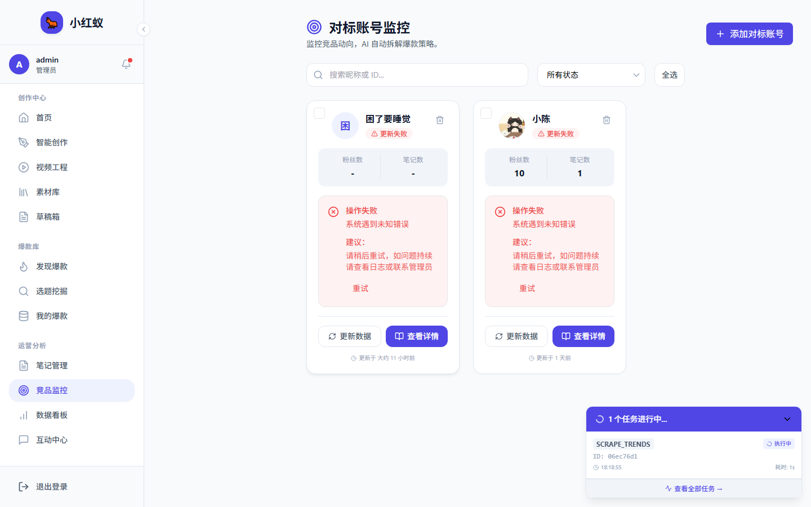
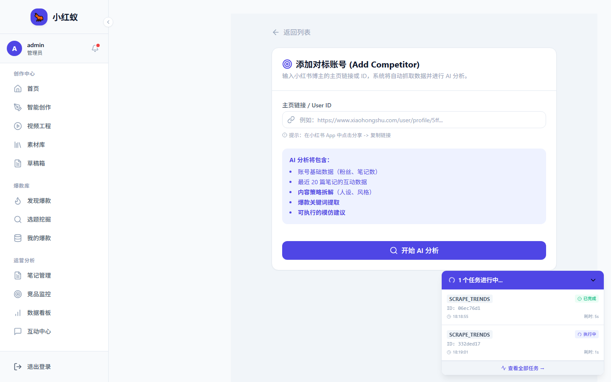

# 添加对标账号并查看 AI 拆解

对标监控是小红蚁的核心功能之一。你可以添加竞品或同领域优质账号，系统会自动抓取数据并用 AI 拆解其爆款策略。

---

## 添加对标账号

### 步骤 1：进入对标账号监控

在左侧导航栏点击 **对标账号监控**。



### 步骤 2：点击添加按钮

点击右上角 **添加对标账号** 按钮。


### 步骤 3：输入小红书主页链接

在输入框中粘贴目标账号的小红书主页链接，例如：

```text
https://www.xiaohongshu.com/user/profile/5ff3e8a9000000000101f3a2
```

!!! tip "如何获取主页链接？"
    1. 打开小红书 App，进入目标账号主页。
    2. 点击右上角 **分享** → **复制链接**。
    3. 将链接粘贴到输入框。




### 步骤 4：开始 AI 分析

点击 **开始 AI 分析**。如果未填写主页链接，页面会弹出提示引导你补充。

系统会：

1. 使用已绑定的浏览账号访问该主页。
2. 抓取笔记列表、粉丝数、获赞数等数据。
3. 调用 AI 分析内容策略、爆款关键词、发布节奏。

> 分析过程中任务中心会显示进度，通常 10~30 秒完成。

### 步骤 5：查看监控卡片

分析完成后，账号会出现在监控列表中，状态为 **监控中**。


---

## 查看 AI 拆解报告

### 进入详情页

点击监控卡片，进入对标账号详情页。

### 报告内容

详情页包含以下模块：

| 模块 | 说明 |
|---|---|
| 账号概览 | 粉丝数、笔记数、最新更新时间 |
| 数据趋势 | 近 30 天粉丝/获赞变化折线图 |
| AI 深度策略拆解 | 核心策略、爆款关键词、内容节奏 |
| 最新笔记 | 按点赞数或发布时间排序的笔记列表 |


---

## 批量更新数据

在监控列表页，可以勾选多个账号，点击 **批量更新**，系统会依次抓取最新数据。

!!! note "更新频率限制"
    为避免触发小红书反爬，建议同一账号每 2~4 小时更新一次。可在 [同步频率与限制](../settings/cron-and-limit.md) 中配置。

---

## 下一步

- [AI 拆解爆款策略](analyze-strategy.md)
- [批量更新数据](batch-refresh.md)
