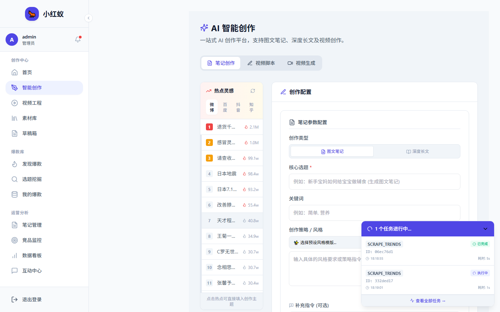
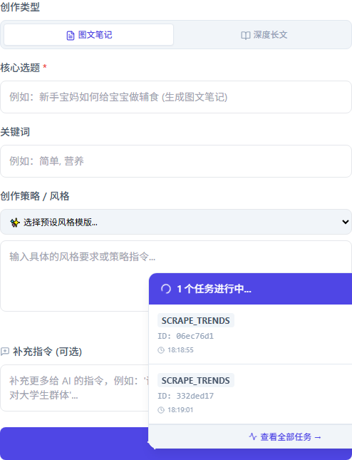

# 生成小红书笔记

小红蚁支持基于主题、关键词、风格等参数，利用 AI 生成小红书风格的笔记内容。

## 操作步骤

1. 点击左侧导航 **内容创作**。

2. 选择 **笔记生成** 标签。
3. 在输入框中填写：
   - **主题**：例如“上海周末探店”
   - **关键词**：例如“咖啡、拍照、打卡”
   - **风格**：例如“轻松日常、干货分享、种草测评”
   - **自定义要求**：例如“控制在 300 字以内，加入 emoji”

4. 点击 **生成笔记**。
5. 等待 AI 返回结果，通常 5~20 秒。

## 结果处理

生成后你可以：

- **复制文本**：直接复制到小红书发布。
- **编辑内容**：点击编辑按钮，在线修改。
- **生成封面**：调用封面编辑器制作配图。
- **保存草稿**：保存到草稿箱，稍后发布。

## 爆款结构复用

在生成时，可以选择 **复用热门笔记结构**。系统会从热门笔记库中提取高赞笔记的标题、结构、节奏，帮助你生成更具爆款潜质的内容。

> 选择复用结构后，AI 会在生成结果中保留原爆款笔记的段落节奏与标题套路。
