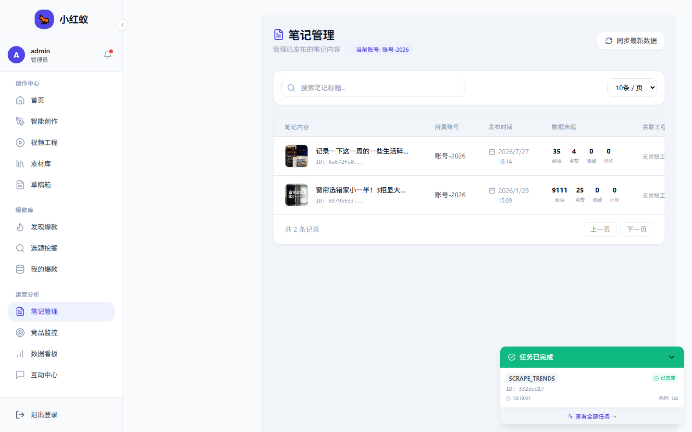

# 笔记管理

笔记管理用于查看、编辑和归档你通过小红蚁生成或同步的笔记内容。

## 功能入口

点击左侧导航 **笔记管理**。

## 主要操作

- **查看详情**：点击任意笔记卡片查看完整内容。
- **编辑**：修改标题、正文、标签。
- **删除**：移除不需要的笔记记录。
- **导出**：支持导出为 Markdown 或文本文件。

## 与草稿箱的区别

| 功能 | 笔记管理 | 草稿箱 |
|---|---|---|
| 内容来源 | 生成、同步、手动创建 | 生成后保存的草稿 |
| 主要用途 | 归档和回顾 | 继续编辑并发布 |
| 发布能力 | 不支持直接发布 | 支持一键发布 |
