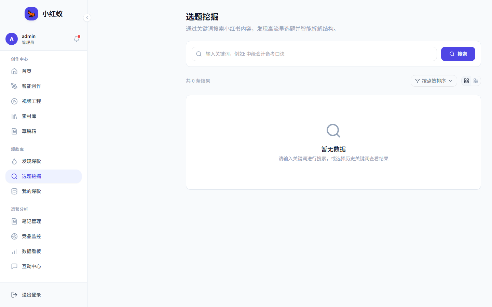

# 选题挖掘

选题挖掘基于热门笔记、对标账号和平台趋势，帮助你找到有高潜力的内容方向。

## 入口

点击左侧导航 **选题挖掘**。

## 核心能力

- **趋势关键词**：自动提取近期热度上升的关键词。
- **选题推荐**：结合你的账号定位推荐可创作的选题。
- **竞争度分析**：评估某个选题下的内容竞争强度。

## 使用方法

1. 进入选题挖掘页面。
2. 选择一个你感兴趣的领域或关键词。
3. 查看系统推荐的选题列表。
4. 点击 **生成笔记** 直接进入内容创作。
