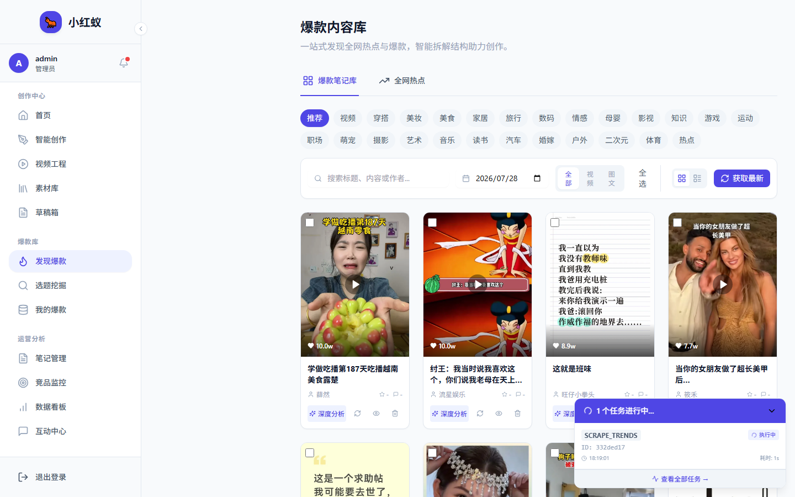

# 热门笔记

热门笔记模块抓取小红书平台的热门内容，帮助你发现趋势和选题方向。

## 入口

点击左侧导航 **热门笔记**。

## 筛选维度

- **分类**：美妆、穿搭、美食、旅行等。
- **时间范围**：24 小时、7 天、30 天。
- **排序**：按点赞、收藏、评论数排序。

## 应用场景

1. **选题参考**：查看高赞笔记的标题和结构。
2. **爆款复用**：在 [生成笔记](generate-note.md) 时选择复用热门结构。
3. **对标分析**：将热门账号加入 [对标监控](../competitor/add-competitor.md)。
