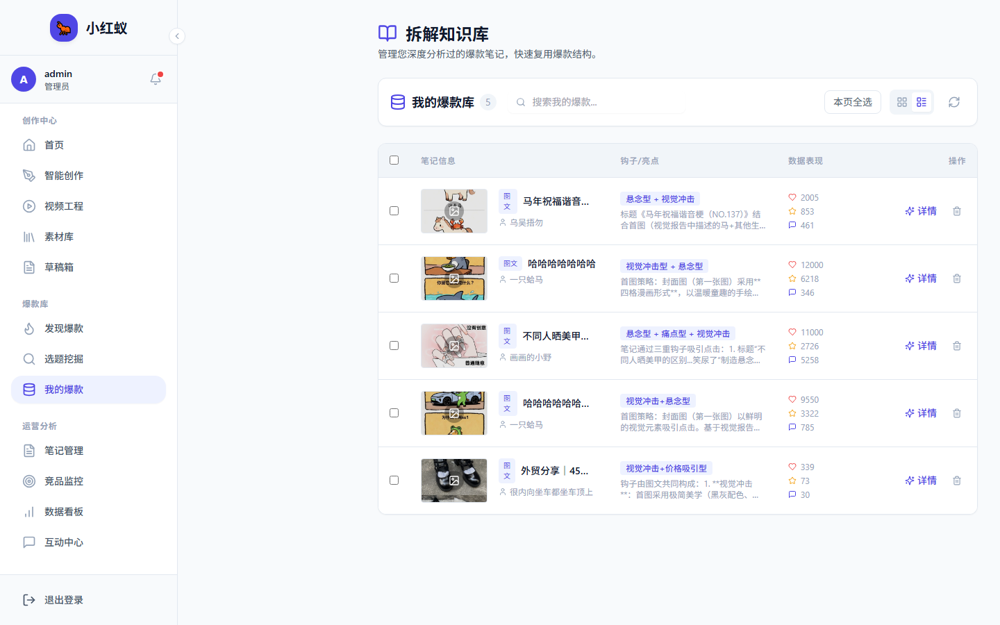

# 我的爆款

我的爆款模块收集并分析你账号下表现优异的笔记，沉淀可复用的爆款经验。

## 入口

点击左侧导航 **我的爆款**。

## 主要功能

- **爆款识别**：自动标记互动量高于平均值的笔记。
- **结构拆解**：分析爆款标题、封面、正文节奏。
- **知识复用**：将爆款特征应用到新内容生成中。

## 使用价值

通过复盘自己的爆款内容，可以逐步建立适合你账号的内容模板，提高后续笔记的爆款概率。
