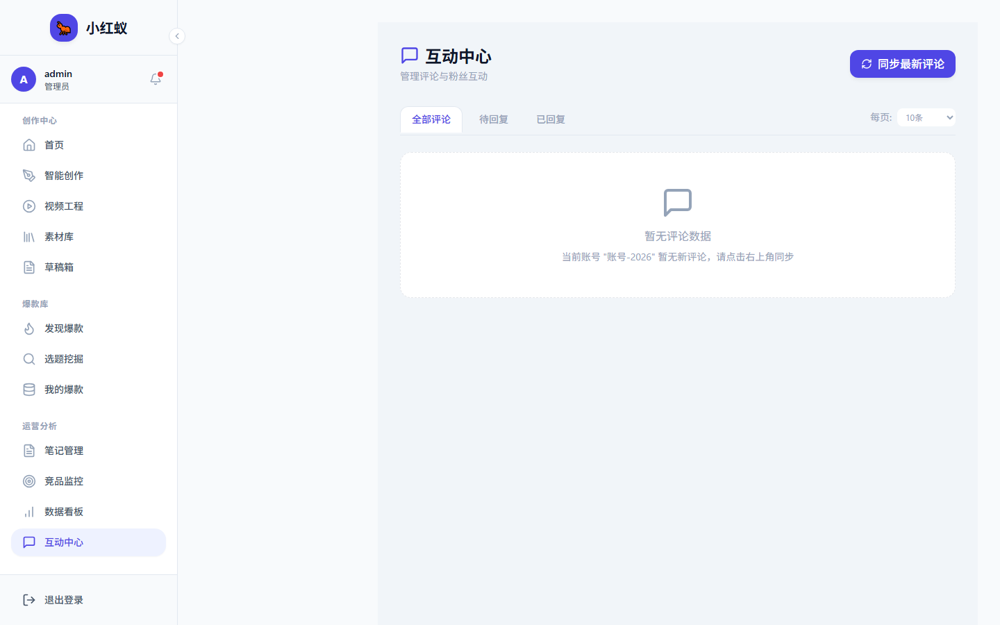

# 同步评论

小红蚁可以将你活跃账号下的评论同步到本地，方便集中管理和回复。

## 操作步骤

1. 确保已 [切换活跃账号](../accounts/switch-account.md) 为可发布状态。
2. 进入 **互动管理** → **评论**。
3. 点击 **同步评论**。

## 筛选与排序

同步完成后，你可以按以下维度筛选：

- **全部**：显示所有评论
- **未回复**：只显示还没回复的评论
- **已回复**：只显示已回复的评论

## 批量处理

- 支持选中多条评论进行批量标记已读/已回复。
- 支持导出评论数据为 Excel/CSV。
