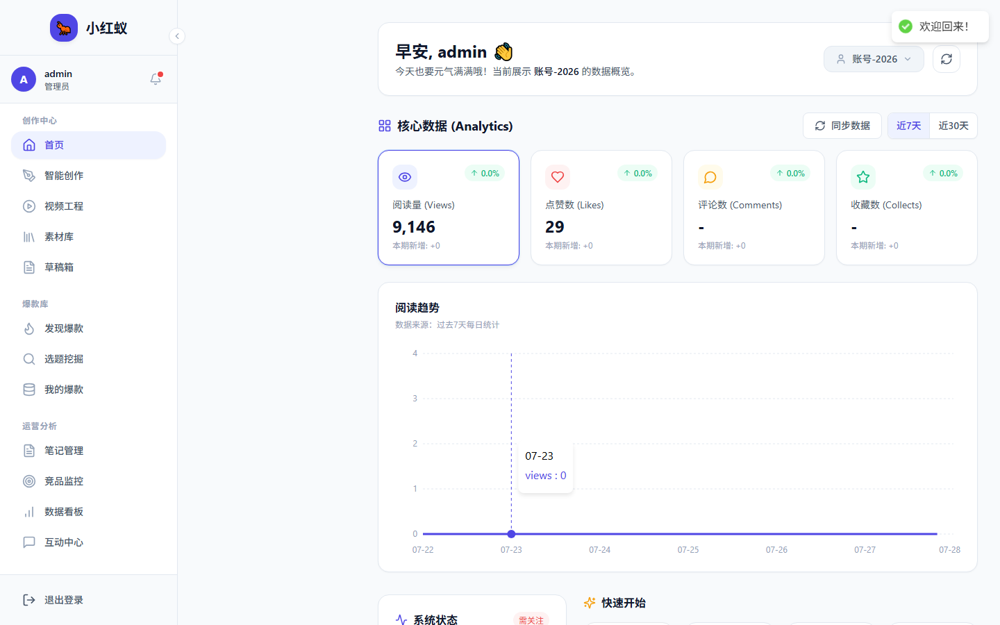

# 界面总览

小红蚁的界面采用左侧导航 + 右侧内容区的布局，桌面端右侧还有 AI 助手面板和底部状态栏。

## 主要区域

### 1. 左侧导航栏

包含所有功能模块的入口：

- **首页**：数据概览和快捷入口
- **内容创作**：AI 生成笔记、视频脚本、封面
- **对标账号监控**：竞品数据跟踪
- **账号矩阵**：多账号管理
- **互动管理**：评论、私信同步
- **热门笔记**：平台趋势发现
- **设置**：账号、AI、系统配置

### 2. 顶部面包屑/标题

显示当前页面标题和主要操作按钮。

### 3. 内容区

展示当前页面的具体功能和数据。

### 4. AI 助手面板（桌面端）

右侧悬浮面板，可快速调用 AI 进行内容润色、策略建议等操作。

### 5. 底部状态栏（桌面端）

显示后端连接状态、当前活跃账号等关键信息。

## 响应式说明

- **桌面端**：完整三栏布局，导航栏 + 内容区 + AI 面板。
- **平板/手机**：导航栏收缩为底部标签或侧边抽屉，AI 面板隐藏。
