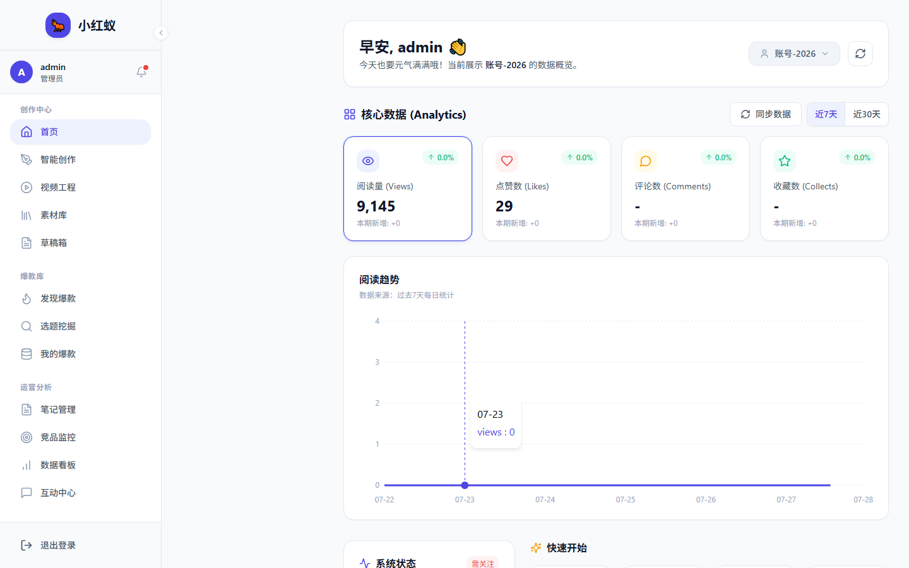

# 首次登录

首次启动小红蚁后，需要完成初始化并创建管理员账号。

## 初始化流程

1. 打开浏览器访问 `http://localhost:5173/`。
2. 如果系统尚未初始化，会自动跳转到 **首次设置** 页面。
3. 设置管理员用户名和密码。
4. 点击 **完成初始化**。

!!! warning "安全提示"
    请妥善保管管理员账号密码。目前版本不支持通过邮箱找回密码，遗忘后需手动重置数据库。

## 登录系统

初始化完成后，使用刚才创建的账号登录：

1. 输入用户名。
2. 输入密码。
3. 点击 **登录**。

登录成功后，页面会自动跳转到首页。

## 登录后第一件事

登录成功后，建议按以下顺序操作：

1. [绑定小红书账号（浏览权限）](../accounts/bind-preview.md)
2. [配置 AI 模型](../settings/ai-provider.md)
3. [添加对标账号](../competitor/add-competitor.md)
