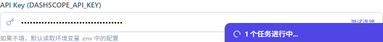

# 配置 AI 模型

小红蚁依赖外部大模型提供 AI 生成、分析能力。目前默认支持 DashScope（通义千问）。

## 获取 API Key

1. 访问 [阿里云 DashScope 控制台](https://dashscope.aliyun.com/)。
2. 注册/登录阿里云账号。
3. 创建 API Key。
4. 复制 Key 值。

## 填入小红蚁

1. 进入 **设置** → **系统配置**。
2. 找到 **DASHSCOPE_API_KEY** 输入框。
3. 粘贴刚才复制的 Key。
4. 点击 **保存**。

## 验证是否生效

保存后，可以尝试 [生成一条笔记](../content/generate-note.md)。如果能正常返回内容，说明配置成功。

## 其他模型

如果后续支持 OpenAI、Claude 等模型，配置方式类似，填写对应 API Key 和模型名称即可。
