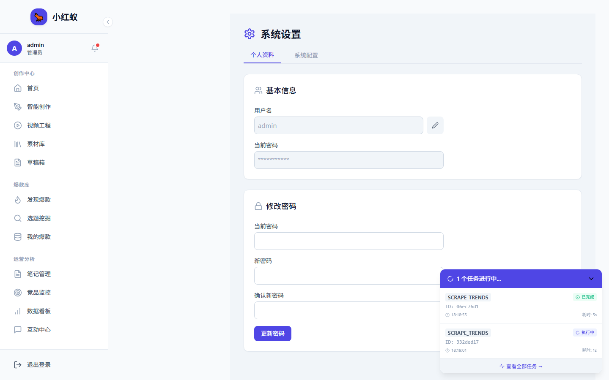

# 修改资料与密码

## 修改个人资料

1. 点击左侧导航 **设置**。

2. 切换到 **个人资料** 标签。
3. 修改 **昵称** 或 **备注**。
4. 点击 **保存**。

## 修改密码

1. 在设置页面切换到 **修改密码** 标签。
2. 输入 **当前密码**。
3. 输入 **新密码**，并再次确认。
4. 点击 **更新密码**。

!!! warning "密码修改后"
    修改密码成功后，当前登录会话会立即失效，系统会倒计时并自动跳转回登录页，请使用新密码重新登录。

## 密码安全建议

- 长度至少 8 位
- 包含大小写字母、数字和特殊字符
- 不要与其他网站使用相同密码
