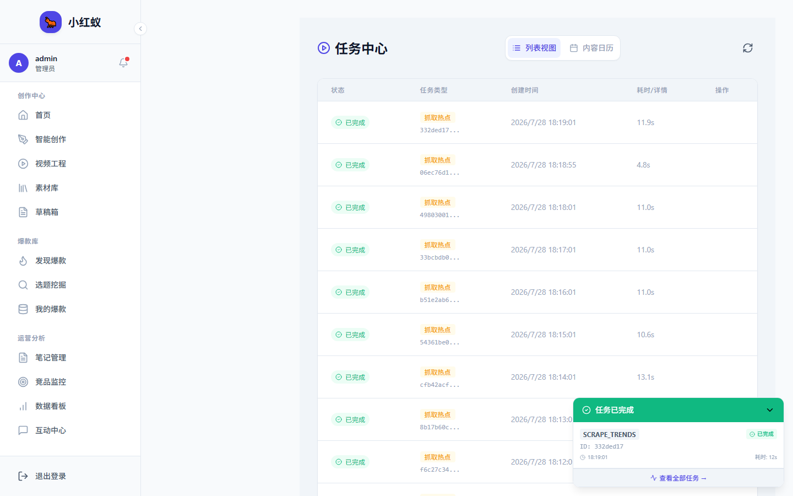

# 任务中心

任务中心集中展示小红蚁中所有异步任务的执行状态和进度，包括数据抓取、内容生成、评论同步等。

## 入口

点击左侧导航 **任务中心**。

## 任务状态

| 状态 | 含义 |
|---|---|
| 等待中 | 任务已创建，正在排队 |
| 运行中 | 任务正在执行 |
| 已完成 | 任务执行成功 |
| 失败 | 任务执行出错，可查看日志 |

## 常见操作

- **查看详情**：点击任务卡片查看日志和结果。
- **重试**：失败任务支持重新执行。
- **取消**：运行中的任务可取消。

## 排查失败任务

如果任务失败，建议先查看任务日志中的错误码，常见错误码含义可参考 [扫码失败排查](../accounts/troubleshoot-login.md) 和 [常见问题](../faq.md)。
