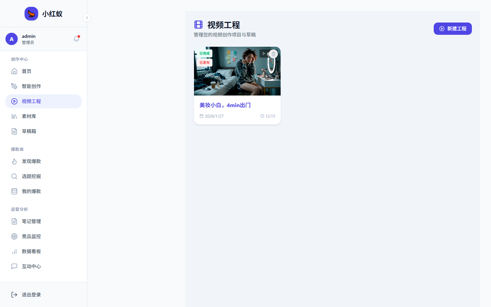

# 视频工程

视频工程模块用于管理和生成视频脚本、分镜、配音等视频相关内容。

## 入口

点击左侧导航 **视频工程**。

## 主要功能

- **脚本管理**：查看所有生成的视频脚本。
- **项目归档**：按主题或账号整理视频项目。
- **素材关联**：将生成的封面、文案与视频项目绑定。

## 与内容创作的关系

视频脚本通常在 [内容创作 → 视频脚本](../content/generate-video.md) 中生成，生成后可进入视频工程进行后续管理和导出。
