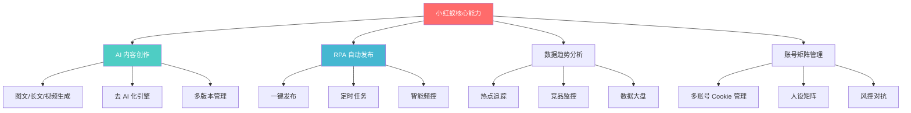
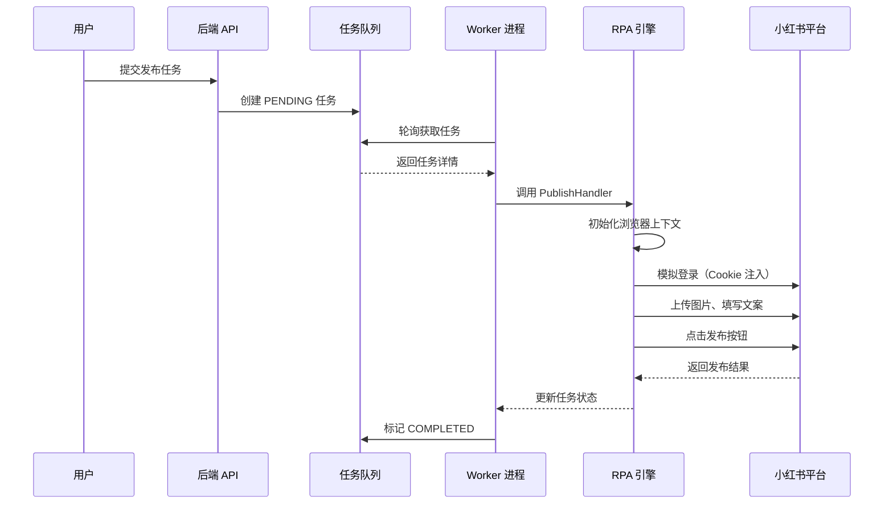
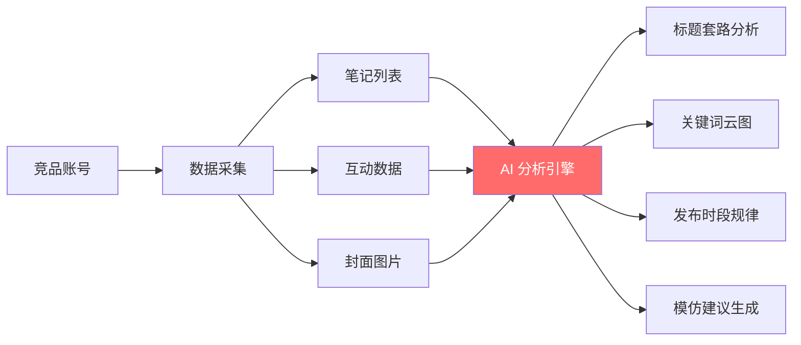
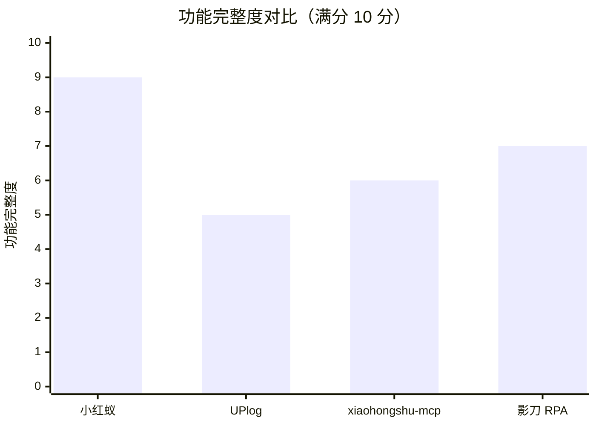
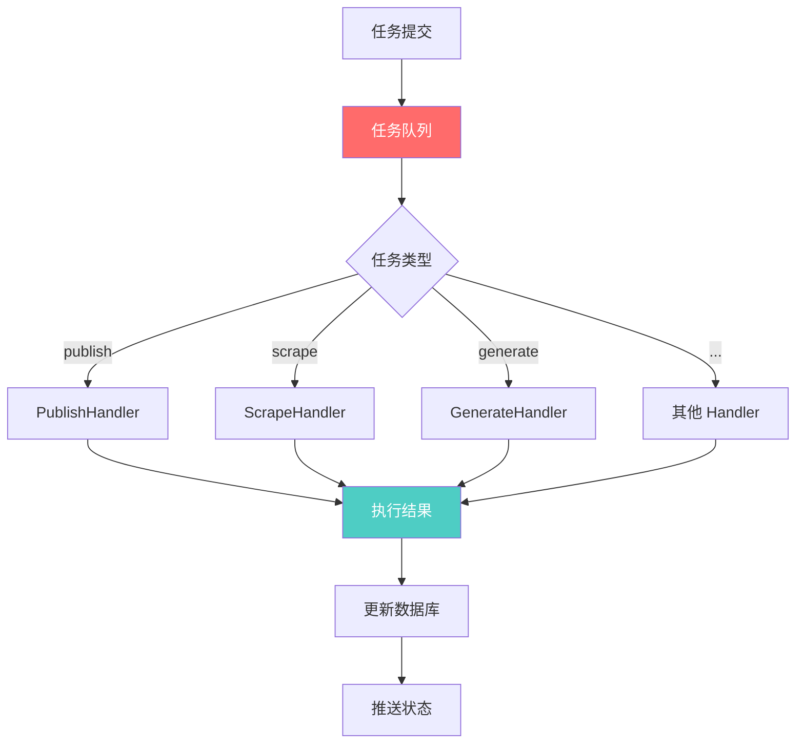

# 小红蚁 (Little Red Ant)：AI + RPA 双引擎驱动的小红书运营全栈方案

> 凌晨2点，第5个账号的笔记还在排队发布。
> 我盯着屏幕上密密麻麻的浏览器标签页，第N次怀疑人生：为什么运营小红书要这么累？

如果你也是小红书运营者，这个场景一定不陌生。

2025年的内容战场，早已不是"单点突破"的时代。矩阵化运营、多账号管理、AI内容生成、数据驱动决策——这些词听着很香，但落地时往往变成：**工具一大堆，数据不互通，人工填缝忙到飞起**。

今天，我想聊聊一个我近期深入研究的开源项目：**小红蚁 (Little Red Ant)**。

它不是又一个"AI写作工具"，而是一套**AI + RPA 双引擎驱动的小红书运营全栈方案**。从内容生成到自动发布，从竞品监控到数据复盘，它试图回答一个问题：**能不能用技术的手段，把小红书运营从"体力活"变成"脑力活"？**

---

## 一、小红蚁是什么？一句话定位

**小红蚁是一款面向小红书运营者的全栈自动化平台，集成了 AI 内容创作、RPA 自动发布、数据趋势分析和账号矩阵管理四大核心能力。**

它解决的核心痛点很直接：
- **创作端**：AI 生成内容千篇一律，缺乏"人味"
- **发布端**：多账号手动操作效率低，容易出错
- **数据端**：竞品数据靠肉眼盯，热点趋势靠直觉猜
- **管理端**：账号一多就乱，Cookie 过期、风控封号防不胜防



---

## 二、8 个核心模块，覆盖小红书运营全链路

### 1. AI 内容创作：不只是"生成"，还要"像人写的"

小红蚁的 AI 模块最打动我的，是它的**"去 AI 化引擎"**。

用过 ChatGPT 写小红书文案的人都知道，AI 生成的内容有一股"机味"：逻辑连接词太多（"首先、其次、综上所述"）、句式太规整、缺乏情绪起伏。平台算法对这种内容的识别越来越精准，流量扶持自然上不去。

小红蚁的做法是：**在 Prompt 层面做"风格特调"**。

它内置了 8 种写作风格，比如：
- **"闺蜜唠嗑"**：口语化、emoji 密集、短句为主
- **"疯狂安利"**：感叹号多、情绪饱满、种草感强
- **"专业测评"**：数据支撑、对比分析、理性种草

```typescript
// 去 AI 化核心逻辑示例（基于项目源码理解）
const deAIifyPrompt = `
  请用以下风格重写内容：
  - 禁用逻辑连接词（首先、其次、综上所述）
  - 多用短句，每句不超过 15 字
  - 每 3 句话插入 1 个 emoji
  - 加入个人经历细节（"我上周试了..."）
  - 结尾用反问句引导互动
`;
```

**使用示例**：
```bash
# 生成一篇"闺蜜唠嗑"风格的穿搭笔记
npm run ai -- say 生成笔记 主题:春季穿搭 风格:闺蜜唠嗑 字数:300
```

### 2. RPA 自动发布：从"人工操作"到"数字员工"

这是小红蚁的技术护城河。

它基于 **Playwright + puppeteer-extra-plugin-stealth** 构建了一套 hardened RPA 层，核心能力包括：

| 能力 | 说明 |
|------|------|
| **持久化浏览器上下文** | Cookie、LocalStorage 自动保存，避免重复登录 |
| **智能选择器** | 多备选项策略，页面改版也能自动适配 |
| **拟人化操作** | 鼠标贝塞尔曲线移动、随机延迟、模拟真实点击 |
| **指纹混淆** | Canvas 噪音、WebGL 伪装，规避风控检测 |
| **状态感知** | 自动检测登录态、弹窗拦截、异常重试 |



### 3. 异步任务中心：全链路可观测

所有耗时操作（AI 生成、爬虫抓取、自动发布）都通过**异步任务队列**处理，前端不再阻塞。

任务状态实时推送，失败自动重试（指数退避：1m → 2m → 4m，最大 3 次）。

```bash
# 查看任务列表
npm run ai -- say 任务列表

# 查看指定任务详情
npm run ai -- say 任务详情 任务ID:xxx
```

### 4. 竞品监控：从"肉眼盯"到"AI 拆解"

小红蚁的竞品监控不是简单的数据抓取，而是**AI 驱动的策略分析**。

它会自动：
1. 抓取对标账号的 Top 10 笔记
2. 提取标题套路、封面风格、关键词布局
3. AI 生成"抄作业"建议（选题方向、避坑指南）



### 5. 热点追踪：聚合多平台趋势

聚合微博热搜、百度热搜、小红书热搜，辅助选题决策。

> [!TIP] 技巧
> 热点追踪支持导出 Excel，方便和团队共享选题池。

### 6. 账号矩阵管理：多账号不混乱

支持：
- **Cookie 智能保活**：自动检测有效性，主站/创作中心 Cookie 互备
- **多账号隔离**：每个账号独立浏览器上下文，避免串号
- **人设矩阵**：一个账号可绑定多个人设（美妆号、宠物号、探店号），一键切换

### 7. 互动中心：评论区运营自动化

- **全量同步**：回溯 7 天内所有评论，自动处理懒加载与分页
- **精准回复**：定位历史评论，拟人化输入 + 自动发送
- **AI 辅助**：自动分析评论情感，生成高情商回复建议

### 8. CLI 工具：开发者的福音

```bash
# 自然语言指令
npm run ai -- say 抓取热搜 weibo
npm run ai -- say 一键发布 主题:春季穿搭 预览
npm run ai -- say 竞品列表

# 确定性命令
npm run ai -- do scrape-trends --source weibo
npm run ai -- do publish --draft-id 123 --account-id 456 --dry-run
```

---

## 三、5 分钟上手：从安装到第一条命令

### 环境要求
- Node.js >= 18
- Chrome/Edge 浏览器（用于 RPA）

### 安装步骤

```bash
# 1. 克隆项目
git clone https://github.com/magicCzc/Little-Red-Ant.git
cd Little-Red-Ant

# 2. 安装依赖
npm install

# 3. 启动开发服务器
npm run dev
```

前端地址：`http://localhost:5173`
后端 API：`http://localhost:3000`

### 首次配置

1. 打开 `http://localhost:5173`，进入登录页
2. 注册管理员账号
3. 进入"设置"页面，配置 AI API Key（Aliyun/DeepSeek）
4. 进入"账号矩阵"，绑定小红书 Cookie

> [!WARNING] 警告
> Cookie 获取方式：登录小红书网页版 → F12 打开开发者工具 → Application → Cookies → 复制相关字段。
> 请勿将 Cookie 泄露给他人，否则可能导致账号被盗。

### 第一条命令

```bash
# 生成一篇测试笔记
npm run ai -- say 生成笔记 主题:测试 风格:闺蜜唠嗑

# 查看生成的草稿
npm run ai -- say 草稿列表
```

---

## 四、小红蚁 vs 其他方案：怎么选？

| 对比维度 | 小红蚁 | UPlog | xiaohongshu-mcp | 影刀 RPA |
|---------|--------|-------|-----------------|----------|
| **定位** | 全栈运营平台 | 内容创作工具 | MCP 协议工具 | 通用 RPA |
| **AI 生成** | ✅ 内置多模型 | ✅ DeepSeek | ❌ 需外部调用 | ❌ 无 |
| **RPA 发布** | ✅ 深度定制 | ❌ 无 | ✅ 基础功能 | ✅ 通用能力 |
| **竞品监控** | ✅ AI 分析 | ❌ 无 | ✅ 基础抓取 | ❌ 无 |
| **账号矩阵** | ✅ 多账号 + 人设 | ❌ 单账号 | ✅ 多账号 | ✅ 多账号 |
| **数据大盘** | ✅ 可视化 | ❌ 无 | ❌ 无 | ❌ 无 |
| **开源** | ✅ 完全开源 | ❌ 商业软件 | ✅ 开源 | ❌ 商业软件 |
| **部署方式** | 本地/Docker | SaaS | 本地 | 本地/SaaS |
| **学习成本** | 中等 | 低 | 高（需懂 MCP） | 高（需学 RPA） |



**选型建议**：
- **个人创作者**：UPlog 上手更快，但功能有限
- **技术团队**：xiaohongshu-mcp 更灵活，但需二次开发
- **企业运营**：影刀 RPA 通用性强，但小红书专属功能欠缺
- **全栈需求**：小红蚁是唯一覆盖"创作-发布-监控-分析"全链路的方案

---

## 五、技术架构：为什么它能做到"全栈"？

小红蚁的技术架构有几个值得借鉴的设计：

### 1. Provider 模式：多模型无缝切换

```typescript
// AI Provider 接口定义
interface AIProvider {
  generateContent(prompt: string): Promise<string>;
  generateImage(prompt: string): Promise<string>;
  generateVideo(prompt: string): Promise<string>;
}

// 具体实现
class AliyunProvider implements AIProvider { /* ... */ }
class DeepSeekProvider implements AIProvider { /* ... */ }
```

新增模型只需实现接口，无需改动业务代码。

### 2. 双策略资源管理：稳定性优先

| 策略 | 适用场景 | 实现方式 |
|------|---------|---------|
| **Plan A: 即时本地化** | AI 生成的高价值资源 | 立即下载到本地，存本地路径 |
| **Plan B: 智能代理** | 抓取的外部资源 | 代理转发，伪造 Referer 防 403 |

### 3. 任务队列：异步化一切



### 4. 风控对抗：多层防御

- **浏览器层**：Stealth 插件、Canvas 噪音、WebGL 伪装
- **操作层**：贝塞尔曲线鼠标移动、随机延迟、拟人化输入
- **策略层**：Daily Limit 频控、异常重试、Cookie 保活

---

## 六、什么时候用它，什么时候不用

### ✅ 推荐场景

- 运营 3 个以上小红书账号，手动操作忙不过来
- 需要批量生成内容，但不想被平台识别为"AI 味"
- 想监控竞品动态，但没时间每天肉眼盯
- 团队有技术能力，愿意自建运营中台

### ❌ 不推荐场景

- 只有 1 个账号，手动操作完全够用
- 完全不懂技术，连 Node.js 都不会装
- 追求"全自动养号"（任何工具都无法保证 100% 安全）
- 内容质量要求极高，AI 生成后不愿人工审核

---

## 七、写在最后

> 工具的价值，不在于它有多强，而在于它能帮上多少忙。

小红蚁不是"万能药"，它只是一个**把重复劳动交给机器，把创造性留给人**的尝试。

在 AI 内容生成工具"去泡沫化"的 2025 年，单纯靠"一键生成"已经不够了。平台算法越来越聪明，用户对"AI 味"内容越来越疲劳，**真正的竞争力在于：能不能用技术的手段，让内容既高效又真实**。

小红蚁的双引擎设计（AI + RPA）提供了一个思路：**AI 负责创意和生成，RPA 负责执行和交付，人负责策略和审核**。

这个分工，可能是未来内容运营的标准范式。

---

**项目已开源，地址：** https://github.com/magicCzc/Little-Red-Ant

**欢迎 Star ⭐ 和 Issue 反馈。**

> 我是 **magicCzc**，一个把 AIOps 当信仰的运维开发工程师。
> GitHub：https://github.com/magicCzc

---

## 参考链接

- [AI内容生成工具"去泡沫化"与用户疲劳现象的多维解析](https://blog.csdn.net/yuntongliangda/article/details/148379283)
- [小红书自动化运营新利器：xiaohongshu-mcp如何用AI重构内容创作流程？](https://www.aitop100.cn/infomation/details/28824.html)
- [RPA也被AI干死了!一键生成监听100个小红书博主的工作流](http://m.toutiao.com/group/7562580197526995482/)
- [影刀+小红书自动化：社媒营销的新范式](https://www.yingdao.com/encyclopedia/detail?uuid=894126102357561344)
